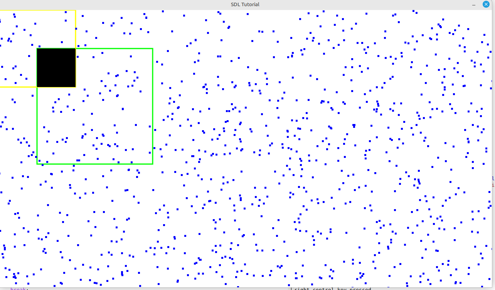

# About

[https://www.gnu.org/software/guile/manual/html_node/Extending-Dia.html]


Cairo-sdl contains 001-window is the most capable C example so far . 

Has almost full keyboard capability , outside of key combinations trapped by window manager.

Moving arrow keys controls a black box on the screen .

The are a number of square balls on the screen behave like bouncing balls as in pong game . 

Function keys understood , Shift , Control + Alt keys all understood left and right . 

In C there is an array of keys if key goes down , event is processed and that key id sets 1 in a big struct . 

when corresponding key is released , event is processed and that key id set to 0 again in the big struct.

## Truetype fonts 

Requires TTInit initialise TT routines 

what do if required font is missing ?


## Require Mouse Events 

Mouse coordinates mouse movement X Y , mouse enter , mouse leave , mouse drag , drag drop if possible be nice capability

## Cairo features

## Common lisp integration

## Guile scheme integration 

what FFI is to be supported ? 

## Guile drawing 

suppose want to be able to draw , then guile will have to have a main loop

be nice to have access to keyboard id's from guile , then we can tell what key is currently down , access to the 
entire structure 

## Guile Loop 1  - with corresponding COOP-REPL-SERVER

A loop - 

```
(define *myglobal* 5)

(define (loop)
	(format #t "myglobal has value ~a~%" *myglobal*)
	(coop-repl-server) ... 
	(loop)
```

## attached to running guile by guile-connect

then passing 

```
(set! *myglobal* 3)
```

should see corresponding change in original program , should now be printing 3 instead of 5 


set of increasing complex programs for very basic user interface

keyboard
mouse
rectangular graphics
bitmap images

lacks polygon colouring - aka cairo library no ffi in guile yet.


decided to explore SDL2 using C language as i think there are some memory leaks in guile SDL2 package

# SDL tutorial

sdl-tutorial directory contains C code experiments

# Cairo SDL tutorial

cairo has some nice shape functions to draw to screen 

## 001 Window

get a window on screen where we can do some SDL rectangle drawing and Cairo drawing 

essentially 32 bit colour screen , can do fullscreen also

cursor arrow keys move square rectangle around screen 

no timing so everything happens as fast as computer can handle , 
events are processed as recognised , otherwise ignored

does identify keyboard left right shift keys ,alt keys , control keys , f1 keys 
and keeps track if key is currently down or up - useful for emacs like key combinations

some key combinations are trapped by window manager , so that is a game loss to alt + tab

does not identify mouse enter , leave , mouse position yet, mouse right left middle clikcs

```
001-window : can we open a sdl2 cairo window and draw something onto screen with cairo 
 simplest proof of concept
```



besides that it seems fairly stable , no growing memory problems at the moment


